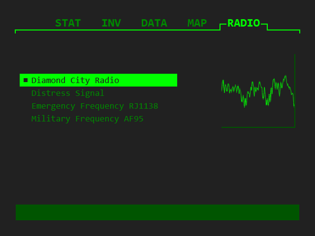

# DiamondCityRadio

This is a web radio station that streams music through an HTTP endpoint. It's based on Rust and web technologies. The project aims to provide a functional, low-latency radio server for a limited set of tracks.

DiamondCityRadio is inspired by "Diamond City Radio" in the video game Fallout 4. The radio plays a mix of 1950's and early 60's tunes. All tracks were ripped from the game using tools like FO4 Audio Ripper and extracted, cleaned, and converted using Audacity and FFmpeg. Travis' voice-overs were also ripped from the game and implemented.

## Features

- Live Music Streaming: Serve music via a standard HTTP stream, playable by most audio players;
- Deterministic Playlist Playlist: Tracks are shuffled based on a seed to ensure playlist replayability. If the server restarts, the same song will be played, at the same time, as if it had never stopped;
- Simple Configuration: The radio station is defined in a simple YAML manifest;
- Track Narration: Songs may have intros and outros, played before/after each track, similar to how Diamond City Radio works in Fallout 4;
- Web UI: Provides a minimal user interface, similar to the "Radio" tab of the Fallout 4 Pip-Boy.

## Drawbacks

- Strict WAV Dependency: All input songs must be in uncompressed WAV format. Compressed formats such as MP3 require FFmpeg-based decompression, which is planned, but not currently implemented. Currently, the application naively streams from uncompressed WAV files;
- WAV format output. The output audio is also uncompressed WAV. This can lead to high bandwidth usage for streaming. In future work, I will use a stream-based encoder, such as Opus or AAC, to stream compressed audio;

## Project Setup

To run the web radio server:

1. Clone the repository.
2. Install Rust;
3. Run the program: `cargo run`.

Simple as that! The default configuration includes the songs that I ripped from the game. The server starts up a web server on `http://0.0.0.0:8000`.

---

Bethesda Softworks LLC. All Rights Reserved.
Fallout 4, Diamond City Radio, and its associated tracks and sounds are the property of Bethesda Softworks LLC. This is a hobby project created for the appreciation of the game Fallout 4.
